# AI-Powered Personalized Healthcare Assistant (Azure)

[](ci-cd/ci.yml)
[](infra/terraform)
[](docs/architecture.md)

An end-to-end, production-grade reference implementation of an enterprise AI/ML system
on Microsoft Azure. The system predicts **30-day hospital readmission risk** for patients
and exposes the result through a secured API, with full MLOps lifecycle support:
data ingestion & validation, feature engineering, model training & evaluation,
responsible AI auditing, model registration, managed deployment, and production monitoring.

> This repository is designed as a portfolio / capability demonstration for a
> **Senior AI/ML Engineer** role, showcasing Azure ML, Terraform-based IaC,
> responsible AI tooling, and GitHub Actions MLOps pipelines.

---

## 1. Use Case

**Problem statement:** Given a patient's demographic, clinical, and historical
encounter data, predict the probability that the patient will be readmitted to
hospital within 30 days of discharge, enabling care teams to prioritize
post-discharge interventions.

- **Model type:** Binary classification (LightGBM / XGBoost)
- **Primary metrics:** ROC-AUC, PR-AUC, Precision/Recall @ threshold, Brier score (calibration)
- **Responsible AI:** SHAP-based explainability, fairness metrics across protected
  attributes (age band, sex, ethnicity), error/slice analysis

---

## 2. High-Level Architecture

```mermaid
flowchart LR
    subgraph Source["Source Systems"]
        EHR[(EHR / Claims Data)]
    end

    subgraph Ingest["Data Pipeline"]
        ADF[Azure Data Factory /\nIngestion Script]
        GE[Great Expectations\nValidation]
        FE[Feature Engineering]
        FS[(Feature Store\nADLS / Feature Tables)]
    end

    subgraph MLPipe["Azure ML Pipeline"]
        TRAIN[Train\nLightGBM/XGBoost]
        TUNE[Hyperparameter\nTuning - Sweep]
        EVAL[Evaluate\nAUC/PR/Calibration]
        RAI[Responsible AI\nSHAP, Fairness, Errors]
        REG[(Model Registry)]
    end

    subgraph Deploy["Deployment"]
        EP[Managed Online\nEndpoint]
        FUNC[Azure Function API\n+ AAD Auth]
    end

    subgraph Monitor["Monitoring"]
        DRIFT[Data & Model\nDrift Detection]
        AI[App Insights]
        ALERT[Alert Rules]
    end

    EHR --> ADF --> GE --> FE --> FS --> TRAIN
    TRAIN --> TUNE --> EVAL --> RAI --> REG --> EP --> FUNC
    FUNC --> AI --> ALERT
    FS --> DRIFT --> AI
    EP --> DRIFT
```



See [docs/architecture.md](docs/architecture.md) for the detailed component breakdown.

---

## 3. Repository Structure

```text
.
├── README.md
├── docs/                       # Architecture, design & operations documentation
├── infra/terraform/            # IaC: modules + dev/prod environments
├── src/
│   ├── common/                 # Shared config, logging, schemas, utils
│   ├── data_pipeline/          # Ingestion, validation (Great Expectations), feature engineering
│   ├── ml_pipeline/             # Training, tuning, evaluation, responsible AI, registration
│   ├── deployment/              # AML managed endpoint, scoring script, Azure Function API
│   └── monitoring/              # Drift detection, App Insights KQL, alert rules
├── ci-cd/                       # GitHub Actions workflows (CI, infra CD, ML CD)
├── tests/                       # Unit, integration, performance tests
└── examples/notebooks/          # EDA, feature prototyping, model experiment notebooks
```

---

## 4. Quickstart

### 4.1 Prerequisites

- Python 3.10+
- [Azure CLI](https://learn.microsoft.com/cli/azure/) (`az login`)
- [Terraform](https://www.terraform.io/) >= 1.6
- An Azure subscription with permissions to create resource groups, AML
  workspaces, storage accounts, Key Vault, and Application Insights

### 4.2 Local setup

```bash
python -m venv .venv && source .venv/bin/activate
pip install -r requirements.txt
```

### 4.3 Provision infrastructure (dev)

```bash
cd infra/terraform/envs/dev
terraform init
terraform plan -out=tfplan
terraform apply tfplan
```

### 4.4 Run the data pipeline locally (simulated)

```bash
python -m src.data_pipeline.ingest --output data/raw/encounters.csv
python -m src.data_pipeline.validate --input data/raw/encounters.csv
python -m src.data_pipeline.transform --input data/raw/encounters.csv --output data/processed/features.parquet
```

### 4.5 Train and evaluate the model

```bash
python -m src.ml_pipeline.train --data data/processed/features.parquet --config configs/train_config.yaml --output-dir outputs
python -m src.ml_pipeline.evaluate --model-path outputs/model.pkl --data outputs/test.parquet --config configs/train_config.yaml --output outputs/metrics.json
```

### 4.6 Run the Responsible AI suite

```bash
python -m src.ml_pipeline.responsible_ai.shap_explainability --model-path outputs/model.pkl --data outputs/test.parquet --output outputs/responsible_ai/shap_report.json
python -m src.ml_pipeline.responsible_ai.fairness_metrics --model-path outputs/model.pkl --data outputs/test.parquet --output outputs/responsible_ai/fairness_report.json
python -m src.ml_pipeline.responsible_ai.error_analysis --model-path outputs/model.pkl --data outputs/test.parquet --output outputs/responsible_ai/error_analysis.json
```

### 4.7 Register & deploy

To check the responsible AI promotion gate locally without an AML workspace:

```bash
python -m src.ml_pipeline.register_model --model-path outputs/model.pkl --model-name readmission-risk-model --dry-run
```

To register the model in an Azure ML workspace (after provisioning infra in 4.3)
and deploy it behind a managed online endpoint:

```bash
python -m src.ml_pipeline.register_model \
  --model-path outputs/model.pkl --model-name readmission-risk-model \
  --subscription-id <subscription-id> --resource-group rg-hcai-dev --workspace-name mlw-hcai-dev
az ml online-endpoint create -f src/deployment/aml_endpoint/endpoint.yml \
  --resource-group rg-hcai-dev --workspace-name mlw-hcai-dev
az ml online-deployment create -f src/deployment/aml_endpoint/deployment.yml \
  --resource-group rg-hcai-dev --workspace-name mlw-hcai-dev --all-traffic
```

---

## 5. Documentation

| Document | Description |
|---|---|
| [architecture.md](docs/architecture.md) | End-to-end system architecture & component diagrams |
| [system-design.md](docs/system-design.md) | Detailed system design, data flows, and design decisions |
| [ml-design.md](docs/ml-design.md) | ML problem framing, features, modeling approach, evaluation |
| [api-design.md](docs/api-design.md) | API contracts, auth model, request/response schemas |
| [responsible-ai-report.md](docs/responsible-ai-report.md) | Fairness, explainability, and error analysis findings |
| [runbook-operations.md](docs/runbook-operations.md) | SRE runbook: deployments, incidents, rollbacks, on-call |

---

## 6. CI/CD

| Workflow | Purpose |
|---|---|
| [ci.yml](ci-cd/ci.yml) | Lint (ruff/black), type-check, unit tests, build artifacts |
| [cd-infra.yml](ci-cd/cd-infra.yml) | Terraform `plan`/`apply` for dev & prod environments |
| [cd-ml.yml](ci-cd/cd-ml.yml) | Run AML training pipeline, register model, deploy endpoint |

> **Note:** Workflow files live in `ci-cd/` per the repository spec. To activate
> them with GitHub Actions, copy or symlink this directory to `.github/workflows/`.

---

## 7. Responsible AI

This project treats responsible AI as a first-class pipeline stage (not an
afterthought):

- **Explainability:** SHAP values (global + local) computed for every registered model
- **Fairness:** Demographic parity, equalized odds, and false-negative-rate parity
  across age band, sex, and ethnicity
- **Error analysis:** Slice-based performance breakdown to detect underperforming cohorts
- **Human-in-the-loop:** Model outputs are risk *scores* for clinician triage, not
  autonomous clinical decisions

See [docs/responsible-ai-report.md](docs/responsible-ai-report.md) for the full report template.

---

## 8. License

This repository is provided for educational/demonstration purposes. Adapt
resource names, subscription IDs, and access policies before any production use.
