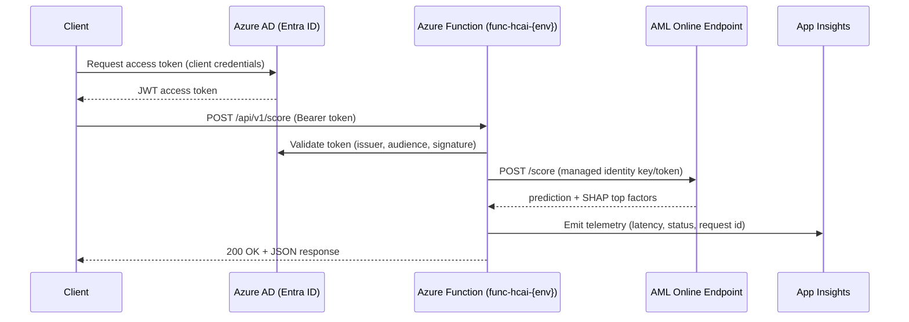

# API Design

## 1. Overview

The system exposes a single secured HTTP API — implemented as an **Azure
Function App** (`src/deployment/api/function_app/`) — that sits in front of
the AML Managed Online Endpoint. This separates business-facing concerns
(authentication, request validation, logging, rate limiting) from the ML
serving runtime.



## 2. Authentication & Authorization

- **Protocol:** OAuth2 client-credentials flow against **Azure AD (Entra ID)**.
- **Token validation:** The Function App validates the `Authorization: Bearer
  <token>` header using the configured AAD tenant (`AAD_TENANT_ID`) and
  expected audience (`AAD_API_AUDIENCE`), via `azure.identity` /
  `PyJWT`-based middleware (`function_app.py`).
- **Authorization:** Callers must present a token with the
  `api://hcai-readmission-api/Score.Invoke` application role/scope.
- **Endpoint-to-AML auth:** The Function App authenticates to the AML
  endpoint using its **system-assigned managed identity**, with the endpoint
  key/token retrieved from **Key Vault** (`kv-hcai-{env}`) — never stored in
  app settings.

## 3. Endpoints

### 3.1 `POST /api/v1/score`

Score a single patient encounter for 30-day readmission risk.

**Request headers**

| Header | Required | Description |
|---|---|---|
| `Authorization` | yes | `Bearer <AAD access token>` |
| `Content-Type` | yes | `application/json` |
| `x-request-id` | no | Client-supplied correlation ID (generated if absent) |

**Request body**

```json
{
  "encounter_id": "ENC-100234",
  "age": 72,
  "sex": "F",
  "insurance_type": "Medicare",
  "admission_type": "Emergency",
  "discharge_disposition": "Home",
  "length_of_stay": 5,
  "comorbidity_count": 3,
  "charlson_index": 4,
  "prior_admissions_12mo": 2,
  "prior_ed_visits_12mo": 1,
  "num_medications": 8,
  "bmi": 29.4,
  "systolic_bp": 138,
  "glucose_level": 145,
  "creatinine": 1.1
}
```

**Response `200 OK`**

```json
{
  "encounter_id": "ENC-100234",
  "model_version": "readmission-risk-model:7",
  "readmission_probability": 0.42,
  "risk_tier": "medium",
  "top_factors": [
    {"feature": "prior_admissions_12mo", "shap_value": 0.11},
    {"feature": "comorbidity_score", "shap_value": 0.08},
    {"feature": "length_of_stay", "shap_value": -0.03}
  ],
  "request_id": "a1b2c3d4-e5f6-7890-abcd-1234567890ab",
  "scored_at": "2025-01-15T10:32:00Z"
}
```

**Risk tiers**

| `readmission_probability` | `risk_tier` |
|---|---|
| `< 0.20` | `low` |
| `0.20 - 0.50` | `medium` |
| `> 0.50` | `high` |

### 3.2 `POST /api/v1/score/batch`

Score a batch (array) of encounters; same item schema as §3.1, max 100 items
per request. Returns an array of the §3.1 response objects under `results`.

### 3.3 `GET /api/v1/health`

Unauthenticated liveness probe.

```json
{ "status": "healthy", "model_version": "readmission-risk-model:7" }
```

## 4. Error Responses

| Status | Condition | Body |
|---|---|---|
| `400` | Malformed JSON / schema validation failure | `{"error": "validation_error", "details": [...]}` |
| `401` | Missing/invalid/expired AAD token | `{"error": "unauthorized"}` |
| `403` | Token valid but missing required scope | `{"error": "forbidden"}` |
| `429` | Rate limit exceeded | `{"error": "rate_limited", "retry_after_seconds": 30}` |
| `500` | Unhandled error / downstream endpoint failure | `{"error": "internal_error", "request_id": "..."}` |
| `503` | AML endpoint unavailable | `{"error": "service_unavailable"}` |

All error responses include the `x-request-id` for traceability in
Application Insights.

## 5. Request Validation Schema

Implemented with `pydantic` models shared between the API layer and the
scoring script to guarantee consistency:

```python
class ScoringRequest(BaseModel):
    encounter_id: str
    age: int = Field(ge=0, le=120)
    sex: Literal["M", "F", "U"]
    insurance_type: str
    admission_type: Literal["Elective", "Emergency", "Urgent"]
    discharge_disposition: str
    length_of_stay: int = Field(ge=0, le=365)
    comorbidity_count: int = Field(ge=0)
    charlson_index: float = Field(ge=0)
    prior_admissions_12mo: int = Field(ge=0)
    prior_ed_visits_12mo: int = Field(ge=0)
    num_medications: int = Field(ge=0)
    bmi: float = Field(gt=0, lt=100)
    systolic_bp: float = Field(gt=0, lt=300)
    glucose_level: float = Field(gt=0, lt=1000)
    creatinine: float = Field(gt=0, lt=20)
```

The canonical definition lives in [`src/common/schemas.py`](../src/common/schemas.py).

## 6. Client Example

See [`src/deployment/api/function_app/client_example.py`](../src/deployment/api/function_app/client_example.py)
for a Python client that acquires an AAD token via `azure-identity` and calls
`/api/v1/score`.

## 7. Rate Limiting & Quotas

- The Function App enforces a per-client (per AAD `appid`) rate limit of
  **60 requests/minute** (configurable via `RATE_LIMIT_RPM` app setting),
  backed by an in-memory token bucket for v1 (Redis-backed bucket recommended
  for multi-instance `prod`).
- Batch requests (`/score/batch`) count as `len(items)` against the quota.

## 8. Versioning

- The API is versioned via URL path (`/api/v1/...`).
- `model_version` in every response reflects the AML Model Registry version
  currently behind the endpoint's active deployment, enabling clients to
  track model changes without an API version bump.
