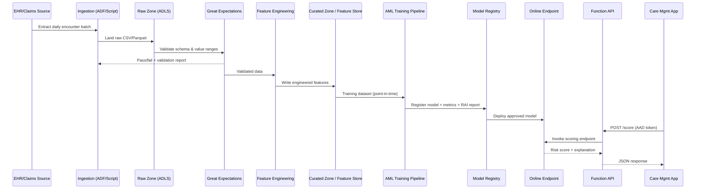

# System Design

## 1. Goals & Non-Goals

### Goals
- Predict 30-day readmission risk for discharged patients with sufficient
  lead time for care-management teams to intervene.
- Provide a reproducible, auditable MLOps lifecycle: data validation → feature
  engineering → training → evaluation → responsible AI review → registration →
  deployment → monitoring.
- Keep infrastructure fully defined as code (Terraform) and pipelines fully
  defined as code (Python + YAML), enabling environment parity between `dev`
  and `prod`.

### Non-Goals
- This system does **not** make autonomous clinical decisions. Output is a
  risk score consumed by clinicians/care managers (human-in-the-loop).
- Real-time streaming ingestion is out of scope for v1 (batch ingestion via
  ADF or simulated batch scripts).

## 2. Data Flow

## 3. Data Model (Core Entities)

| Entity | Key Fields | Notes |
|---|---|---|
| `Patient` | `patient_id`, `age`, `sex`, `ethnicity`, `insurance_type` | Demographics; `sex`/`ethnicity`/`age_band` used for fairness slices |
| `Encounter` | `encounter_id`, `patient_id`, `admit_date`, `discharge_date`, `length_of_stay`, `discharge_disposition`, `admission_type` | One row per inpatient stay |
| `Diagnosis` | `encounter_id`, `primary_diagnosis_code`, `comorbidity_count`, `charlson_index` | Clinical severity indicators |
| `Utilization` | `patient_id`, `prior_admissions_12mo`, `prior_ed_visits_12mo`, `num_medications` | Historical utilization features |
| `Labs/Vitals` | `encounter_id`, `bmi`, `systolic_bp`, `glucose_level`, `creatinine` | Latest available lab/vital snapshot |
| `Label` | `encounter_id`, `readmitted_30d` (0/1) | Generated retrospectively for training |

Canonical schemas are defined in [`src/common/schemas.py`](../src/common/schemas.py).

## 4. Pipeline Stages (Detail)

### 4.1 Ingestion (`src/data_pipeline/ingest.py`)
- Simulates an Azure Data Factory copy activity: pulls (or generates)
  synthetic encounter-level records and writes to the raw zone.
- In a production deployment, this is replaced by an ADF pipeline triggered
  on a schedule (see `docs/architecture.md`), landing data in
  `abfss://raw@sthcai<env>001.dfs.core.windows.net/encounters/`.

### 4.2 Validation (`src/data_pipeline/validate.py` + `great_expectations/`)
- A Great Expectations suite (`encounters_suite.json`) enforces:
  - Required columns present and correctly typed
  - Value ranges (e.g., `age` between 0–120, `length_of_stay` >= 0)
  - Categorical domains (e.g., `sex` in `{M, F, U}`)
  - Null thresholds on critical fields
- Validation failures halt the pipeline and emit a structured report.

### 4.3 Feature Engineering (`src/data_pipeline/transform.py`, `feature_engineering.py`)
- Derives:
  - `age_band` (categorical bucket for fairness slicing)
  - `comorbidity_score` (weighted comorbidity index)
  - `prior_utilization_rate` (prior admissions / months observed)
  - `polypharmacy_flag` (num_medications >= 5)
  - `los_bucket` (length-of-stay bucket)
- Output written as Parquet to the curated zone / feature store.

### 4.4 Feature Store (`src/data_pipeline/feature_store.py`)
- Thin interface abstraction over ADLS-backed Parquet "feature tables" with
  `get_offline_features()` (training) and `get_online_features()` (low-latency
  lookups for scoring), enabling later substitution with a managed feature
  store (e.g., Azure ML Managed Feature Store) without changing pipeline code.

### 4.5 Training (`src/ml_pipeline/train.py`)
- Trains a LightGBM (default) or XGBoost classifier on the curated feature
  table with a temporal train/validation/test split to avoid leakage.
- Hyperparameters are externalized via `configs/train_config.yaml` and may be
  swept via [`hyperparameter_tuning.py`](../src/ml_pipeline/hyperparameter_tuning.py).

### 4.6 Evaluation (`src/ml_pipeline/evaluate.py`)
- Computes ROC-AUC, PR-AUC, precision/recall/F1 at configurable thresholds,
  and calibration (reliability curve + Brier score).
- Persists `metrics.json` alongside the model artifact.

### 4.7 Responsible AI (`src/ml_pipeline/responsible_ai/`)
- `shap_explainability.py`: global feature importance + per-prediction SHAP
  values.
- `fairness_metrics.py`: demographic parity difference, equalized odds
  difference, and FNR parity across `sex`, `age_band`, `ethnicity` using
  `fairlearn`.
- `error_analysis.py`: slice-based error rates to surface underperforming
  cohorts.

### 4.8 Registration (`src/ml_pipeline/register_model.py`)
- Registers the model artifact, metrics, and responsible AI report as a
  versioned model in the AML Model Registry with tags for lineage
  (`git_sha`, `training_run_id`, `data_version`).

### 4.9 Deployment
- `src/deployment/aml_endpoint/endpoint.yml` + `deployment.yml` define a
  Managed Online Endpoint and a blue/green-capable deployment.
- `src/deployment/scoring/score.py` is the inference entry point
  (`init()`/`run()`).
- `src/deployment/api/function_app/` exposes a secured HTTP API in front of
  the endpoint for downstream consumers.

### 4.10 Monitoring
- `src/monitoring/data_drift_detection.py` compares live scoring input
  distributions to the training baseline (PSI/KS tests).
- `src/monitoring/model_drift_detection.py` tracks rolling prediction
  distributions and (where ground truth becomes available) rolling AUC.
- KQL queries and Azure Monitor alert rules surface drift and latency/error
  anomalies.

## 5. Non-Functional Requirements

| Requirement | Target | How addressed |
|---|---|---|
| Endpoint latency (p95) | < 300ms | Lightweight gradient-boosted model, warm AML instance |
| Endpoint availability | 99.9% (prod) | Managed Online Endpoint with autoscale 1-4 nodes |
| Reproducibility | 100% | Pinned dependencies, config-driven pipeline, model lineage tags |
| Data quality | 0 schema violations to training | Great Expectations gate before feature engineering |
| Auditability | Full | Responsible AI report stored with every registered model version |

## 6. Key Design Decisions

| Decision | Rationale |
|---|---|
| LightGBM/XGBoost over deep learning | Tabular clinical data; gradient-boosted trees offer strong accuracy, fast training, and native SHAP support |
| Managed Online Endpoint + Function API | Separates ML serving (AML) from business API concerns (auth, rate limiting, logging) |
| Terraform modules per resource | Enables environment parity and independent versioning of infra components |
| Great Expectations gate | Fails fast on data quality issues before expensive training jobs run |
| Responsible AI as pipeline stage | Ensures every registered model has an associated fairness/explainability artifact, not an optional afterthought |
